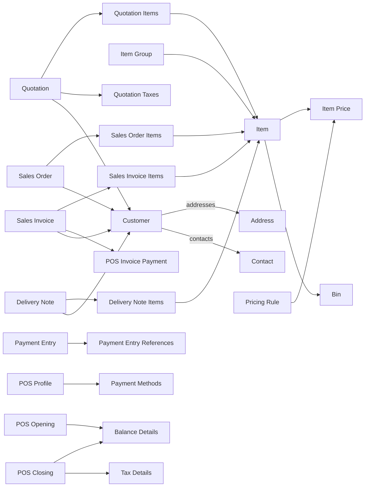

# Local document composition (v2)

This module reconstructs ERPNext documents locally by composing flat header rows with their
related child tables. All joins must use the composite key `(instanceId, companyId, docId)`
where `docId` is the primary identifier for the document type.

## Customers
### Customer
- **Header:** `CustomerEntity` (`customersv2` table)
- **Child tables:** `CustomerAddressEntity` (`customer_address`), `CustomerContactEntity` (`customer_contact`)
- **Join keys:** `(instanceId, companyId, customerId)`

### Address
- **Header:** `CustomerAddressEntity` (`customer_address` table)
- **Child tables:** none
- **Join keys:** `(instanceId, companyId, addressId)` (linked to customer via `customerId`)

### Contact
- **Header:** `CustomerContactEntity` (`customer_contact` table)
- **Child tables:** none
- **Join keys:** `(instanceId, companyId, contactId)` (linked to customer via `customerId`)

## Catalog
### Item
- **Header:** `ItemEntity` (`items` table)
- **Child tables:** none
- **Join keys:** `(instanceId, companyId, itemId)`

### Item Group
- **Header:** `ItemGroupEntity` (`item_groups` table)
- **Child tables:** none
- **Join keys:** `(instanceId, companyId, itemGroupId)`

### Item Price
- **Header:** `ItemPriceEntity` (`item_prices` table)
- **Child tables:** none
- **Join keys:** `(instanceId, companyId, itemId, priceList)`

### Bin
- **Header:** `InventoryBinEntity` (`inventory_bins` table)
- **Child tables:** none
- **Join keys:** `(instanceId, companyId, warehouseId, itemId)`

## POS Context
### Company
- **Header:** `CompanyEntity` (`companies` table)
- **Child tables:** none
- **Join keys:** `(instanceId, companyId)`

### User
- **Header:** `UserEntity` (`users` table)
- **Child tables:** none
- **Join keys:** `(instanceId, companyId, userId)`

### Employee
- **Header:** `EmployeeEntity` (`employees` table)
- **Child tables:** none
- **Join keys:** `(instanceId, companyId, employeeId)`

### Sales Person
- **Header:** `SalesPersonEntity` (`sales_people` table)
- **Child tables:** none
- **Join keys:** `(instanceId, companyId, salesPersonId)`

### POS Profile
- **Header:** `POSProfileEntity` (`pos_profiles` table)
- **Child tables:** `POSPaymentMethodEntity` (`pos_payment_methods` table)
- **Join keys:** `(instanceId, companyId, posProfileId)`

### Payment Methods
- **Header:** `POSPaymentMethodEntity` (`pos_payment_methods` table)
- **Child tables:** none (child rows of `POSProfileEntity`)
- **Join keys:** `(instanceId, companyId, posProfileId, modeOfPayment)`

## Sales
### Quotation
- **Header:** `QuotationEntity` (`quotations` table)
- **Child tables:** `QuotationItemEntity` (`quotation_items`), `QuotationTaxEntity` (`quotation_taxes`),
  `QuotationCustomerLinkEntity` (`quotation_customer_links`)
- **Join keys:** `(instanceId, companyId, quotationId)`

### Sales Order
- **Header:** `SalesOrderEntity` (`sales_orders` table)
- **Child tables:** `SalesOrderItemEntity` (`sales_order_items`)
- **Join keys:** `(instanceId, companyId, salesOrderId)`

### Sales Invoice
- **Header:** `SalesInvoiceEntity` (`sales_invoices` table)
- **Child tables:** `SalesInvoiceItemEntity` (`sales_invoice_items`),
  `SalesInvoicePaymentEntity` (`sales_invoice_payments`)
- **Join keys:** `(instanceId, companyId, invoiceId)`

### Delivery Note
- **Header:** `DeliveryNoteEntity` (`delivery_notes` table)
- **Child tables:** `DeliveryNoteItemEntity` (`delivery_note_items`), `DeliveryNoteLinkEntity` (`delivery_note_links`)
- **Join keys:** `(instanceId, companyId, deliveryNoteId)`

## Payments
### Payment Entry
- **Header:** `PaymentEntryEntity` (`payment_entries` table)
- **Child tables:** `PaymentEntryReferenceEntity` (`payment_entry_references`)
- **Join keys:** `(instanceId, companyId, paymentEntryId)`

### POS Invoice Payment
- **Header:** `SalesInvoicePaymentEntity` (`sales_invoice_payments` table)
- **Child tables:** none (child rows of `SalesInvoiceEntity`)
- **Join keys:** `(instanceId, companyId, invoiceId, paymentId)`

## Cashbox (legacy tables)
### POS Opening Entry
- **Header:** `POSOpeningEntryEntity` (`tab_pos_opening_entry` table)
- **Child tables:** `BalanceDetailsEntity` (`balance_details`)
- **Join keys:** `name` + `pos_opening_entry` (legacy tables do not yet include `instanceId`/`companyId`)

### POS Closing Entry
- **Header:** `POSClosingEntryEntity` (`tab_pos_closing_entry` table)
- **Child tables:** `TaxDetailsEntity` (`tax_details`), `BalanceDetailsEntity` (`balance_details`)
- **Join keys:** `name` + `pos_closing_entry` (legacy tables do not yet include `instanceId`/`companyId`)

## Taxes / Charges (if applicable)
### Quotation Taxes
- **Header:** `QuotationTaxEntity` (`quotation_taxes` table)
- **Child tables:** none (child rows of `QuotationEntity`)
- **Join keys:** `(instanceId, companyId, quotationId)`

### POS Closing Taxes
- **Header:** `TaxDetailsEntity` (`tax_details` table)
- **Child tables:** none (child rows of `POSClosingEntryEntity`)
- **Join keys:** `name` + `pos_closing_entry`

## Pricing Rule
- **Header:** `PricingRuleEntity` (`pricing_rules` table)
- **Child tables:** none
- **Join keys:** `(instanceId, companyId, pricingRuleId)`

## Document Composition Diagram (Mermaid)

