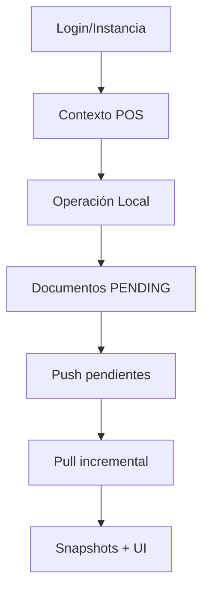
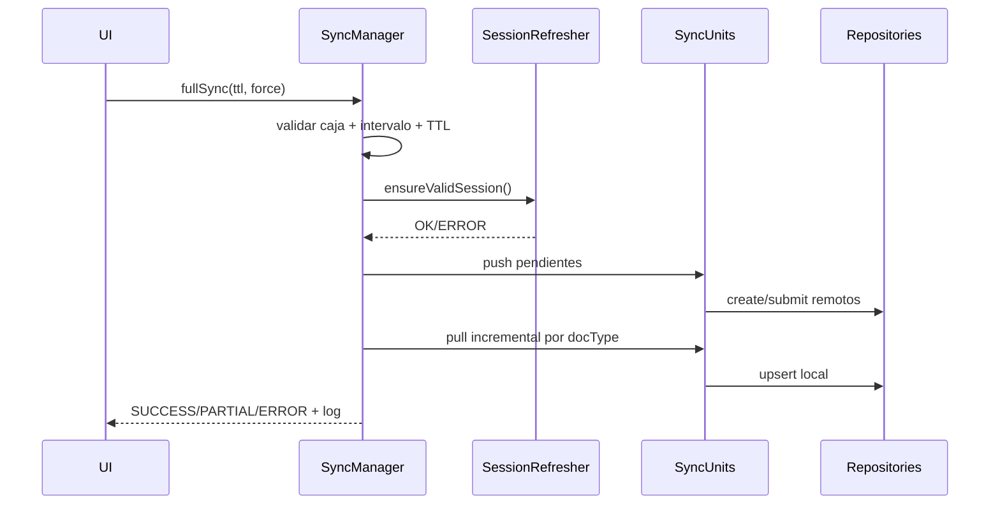

# Flujos funcionales y de sincronización (cobertura completa)

## 1. Flujo global de operación

## 2. Flujos comerciales completos

## 2.1 Venta POS (invoice)
1. Carga cliente + catálogo + stock local.
2. Validación de reglas de negocio.
3. Persistencia local de factura y pagos.
4. Estado inicial `PENDING`.
5. Push remoto y actualización a `SYNCED` o `FAILED`.

## 2.2 Cobro (payment entry)
1. Selección de facturas abiertas.
2. Construcción de referencias aplicadas.
3. Registro local y/o remoto según conectividad.
4. Reconciliación de outstanding en siguiente pull.

## 2.3 Cliente
1. Consulta cartera y datos de contacto/dirección.
2. Alta cliente local y push posterior.
3. Enriquecimiento de contacto/dirección.

## 2.4 Caja
1. Apertura de caja (`POS Opening Entry`).
2. Operación de ventas durante turno.
3. Cierre de caja (`POS Closing Entry`).
4. Submit de documentos de caja.

## 3. Flujos de sincronización detallados

## 3.1 Pull incremental
- Se ejecuta por docType con filtros de sincronización.
- Usa `modified`, fechas de ventana, territorio, bodega y lista de precios.
- Actualiza local DB y estados de snapshot.

## 3.2 Push pendientes
- Recorre documentos con `PENDING`.
- Invoca endpoint create/submit según tipo documental.
- Marca éxito/fallo y contabiliza pendientes/errores.

## 3.3 Política de retries
- Reintento para errores de timeout/red.
- Backoff exponencial en utilidades de fetch.
- Errores de negocio quedan como `FAILED` para revisión/reintento dirigido.

## 4. Flujo de sincronización completa

## 5. DocTypes considerados en sincronización

- Company
- Employee
- Sales Person
- Item
- Category
- Item Price
- User
- Address
- Contact
- Customer
- Sales Invoice
- Quotation
- Sales Order
- Payment Entry
- Delivery Note
- Pricing Rule
- Bin
- Purchase Invoice
- Stock Entry
- POS Profile
- POS Profile Details
- POS Opening Entry
- POS Closing Entry

## 6. Flujos de error (matriz)

| Escenario | Comportamiento esperado |
|---|---|
| Sin internet | Continuar local, no romper UI |
| Token vencido con refresh válido | Refresh silencioso y continuar |
| Token inválido y refresh fallido | Invalidar sesión y navegar a login |
| Falla parcial de sync | Estado PARTIAL + lista de pasos fallidos |
| Endpoint caído | Reintento + fallback local |

## 7. Indicadores operativos sugeridos
- Edad del último full sync.
- Pendientes por tipo documental.
- Fallidos por tipo documental.
- Tiempo promedio de push/pull.
- % éxito de sync por ventana temporal.
