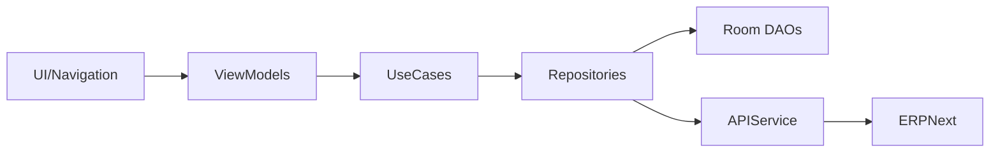
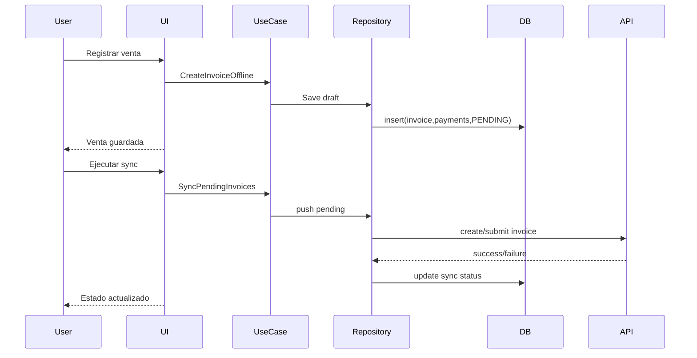

# Diagrama de funciones y mapa de responsabilidades

## 1. Mapa de funciones de la app completa

```mermaid
graph TD
    subgraph App
        A1[Auth/Login]
        A2[POS Sales]
        A3[Payments]
        A4[Customers]
        A5[Catalog/Inventory]
        A6[Cashbox]
        A7[Sync]
    end

    A1 --> B1[SessionRefresher]
    A1 --> B2[TokenHeartbeat]
    A1 --> B3[InstanceSwitcher]

    A2 --> C1[CreateInvoiceOfflineUseCase]
    A2 --> C2[CreateSalesInvoiceUseCase]

    A3 --> D1[CreatePaymentEntryOfflineUseCase]
    A3 --> D2[CreatePaymentEntryUseCase]

    A4 --> E1[CreateCustomerOfflineUseCase]
    A4 --> E2[FetchCustomersUseCase]

    A5 --> F1[LoadCatalogUseCase]
    A5 --> F2[FetchBillingProductsWithPriceUseCase]

    A6 --> G1[openCashbox]
    A6 --> G2[closeCashbox]

    A7 --> H1[SyncManager]
    A7 --> H2[RunFullSyncUseCase]
    A7 --> H3[SyncItemsUseCase]
    A7 --> H4[SyncCustomersUseCase]
    A7 --> H5[SyncBinsUseCase]
    A7 --> H6[SyncItemPricesUseCase]
```

## 2. Mapa capas -> funciones

## 3. Mapa endpoint -> función interna

| Función app | Endpoint lógico | DTO principal |
|---|---|---|
| Login OAuth | auth.exchange / auth.refresh | `TokenResponse` |
| Cargar usuario | user.get | `UserDto` |
| Cargar perfil POS | pos_profile.get / list | `POSProfileDto`, `POSProfileSimpleDto` |
| Crear factura | sales_invoice.create | `SalesInvoiceDto` / `SalesInvoiceCreateDto` |
| Submit factura | sales_invoice.submit | `SubmitResponseDto` |
| Cancel factura | sales_invoice.cancel | `SubmitResponseDto` |
| Crear pago | payment_entry.create | `PaymentEntryCreateDto` |
| Submit pago | payment_entry.submit | `SubmitResponseDto` |
| Crear cliente | customer.create | `CustomerCreateDto` |
| Cargar inventario | bin/item/item_price list | `BinDto`, `ItemDto`, `ItemPriceDto` |
| Apertura caja | pos_opening.create | `POSOpeningEntryDto` |
| Cierre caja | pos_closing.create | `POSClosingEntryDto` |

## 4. Secuencia de funciones críticas

