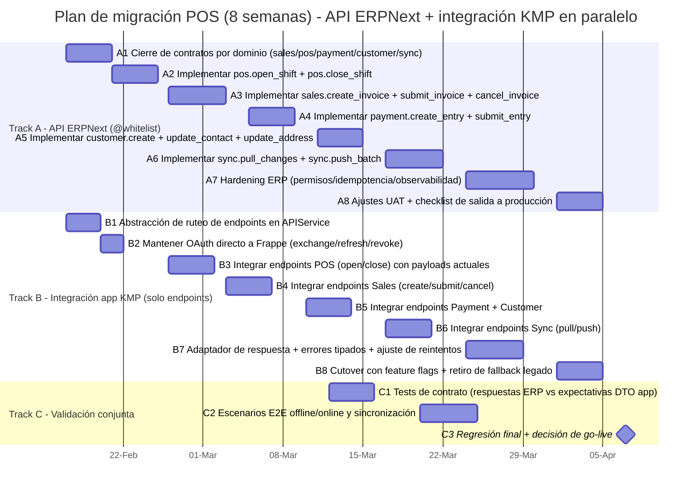

# Plan técnico de ejecución (8 semanas): migración de endpoints a ERPNext `@frappe.whitelist` + integración KMP

## Objetivo
Entregar, en **máximo 2 meses (8 semanas)**, una migración controlada enfocada en:
1. Reemplazar los endpoints de negocio usados por la app móvil POS con métodos de dominio `@frappe.whitelist`.
2. Mantener los endpoints de autenticación **directamente en Frappe OAuth** (sin métodos whitelist para exchange/login/refresh/revoke).
3. Limitar el impacto en la app a mapeo de endpoints + adaptación de respuestas/errores, sin cambiar el comportamiento de negocio principal.

---

## 1) Alcance y restricciones no negociables

### En alcance
- Desarrollo de API ERPNext para dominios de negocio (`pos`, `sales`, `payment`, `customer`, `sync`, `bootstrap` opcional).
- Cambios KMP solo en la capa de transporte/integración (`APIService`, ruteo de endpoints, mapeo de respuestas/errores).
- Estandarización de manejo de errores y normalización de respuestas para endpoints nuevos.
- Ejecución en paralelo de ambos frentes (API ERP + integración móvil).

### Fuera de alcance
- Reescritura de lógica de negocio en módulos de app (billing, lógica de inventario, motor de decisiones de sync).
- Rediseño de UI o de flujos funcionales.
- Reemplazo de OAuth por métodos personalizados.

### Regla fija de autenticación
Los siguientes endpoints se mantienen como métodos directos de Frappe:
- `/api/method/frappe.integrations.oauth2.get_token` (exchange + refresh)
- `/api/method/frappe.integrations.oauth2.revoke_token`
- Ruta actual de login/session bootstrap ya usada por la app

---

## 2) Arquitectura objetivo (migración de mínimo impacto)

## A. Lado ERPNext (nuevo)
- Nuevo namespace: `erpnext_pos.api.mobile.v1.*`
- Nuevos métodos de negocio por dominio con contratos estables request/response.
- Sin reemplazo de auth.

## B. Lado app KMP (mínimo cambio)
- Mantener el comportamiento actual de dominio/use cases.
- Reemplazar URLs de endpoints en la capa de integración.
- Agregar adaptador de respuesta para parsear legado (`data/message`) y nuevo (`ok/data/error/meta`) durante transición.
- Agregar mapeo robusto de errores tipados para fallas seguras en UI y lógica de reintentos.

---

## 3) Gantt paralelo (específico: API ERP + integración app)



> Duración total: 8 semanas, con ejecución explícitamente paralela.

---

## 4) Plan semanal (entregables en paralelo)

| Semana | Entregable ERPNext `@whitelist` | Entregable integración KMP | Puerta de validación |
|---|---|---|---|
| W1 | Cierre de contratos para todos los dominios de negocio | Abstracción de endpoints y tabla de rutas en capa API | Contratos aprobados |
| W2 | Métodos POS listos (`open_shift`, `close_shift`) | Cambio de rutas POS en app, sin alterar comportamiento | Smoke test POS |
| W3 | Métodos Sales listos (`create/submit/cancel`) | Cambio de rutas Sales en app | E2E factura (draft-submit-cancel) |
| W4 | Métodos Payment + Customer listos | Cambio de rutas Payment/Customer en app | Regresión Customer+Payment |
| W5 | Métodos Sync listos (`pull_changes`, `push_batch`) | Cambio de rutas Sync en app | Pruebas cola offline + recuperación |
| W6 | Hardening de permisos/idempotencia | Ajuste de mapeo de errores + política de reintentos | Matriz de errores aprobada |
| W7 | Ajustes UAT + observabilidad final | Cutover con feature flags en staging | Sign-off de staging |
| W8 | Preparación final de producción y soporte de release | Retiro de fallback legado (si estable) | Go-live + post-checks |

---

## 5) Matriz de migración de endpoints (reglas actualizadas)

| Flujo | Endpoint actual | Endpoint objetivo |
|---|---|---|
| OAuth exchange code | `/api/method/frappe.integrations.oauth2.get_token` | **Se mantiene actual (no migra a whitelist)** |
| OAuth refresh token | `/api/method/frappe.integrations.oauth2.get_token` | **Se mantiene actual (no migra a whitelist)** |
| OAuth revoke | `/api/method/frappe.integrations.oauth2.revoke_token` | **Se mantiene actual (no migra a whitelist)** |
| POS open/close | Flujo actual de create/submit | `/api/method/erpnext_pos.api.mobile.v1.pos.open_shift` / `close_shift` |
| Sales create/submit/cancel | `resource + frappe.client.submit/cancel` | `/api/method/erpnext_pos.api.mobile.v1.sales.*` |
| Payment create/submit | `resource + frappe.client.submit` | `/api/method/erpnext_pos.api.mobile.v1.payment.*` |
| Customer create/update | `resource + frappe.client.set_value` | `/api/method/erpnext_pos.api.mobile.v1.customer.*` |
| Sync pull/push | consultas mixtas `resource` | `/api/method/erpnext_pos.api.mobile.v1.sync.*` |

---

## 6) Adaptación estándar de respuesta/error (integración segura)

### Envelope recomendado para éxito
```json
{
  "ok": true,
  "data": {},
  "error": null,
  "meta": {
    "request_id": "uuid",
    "api_version": "v1",
    "server_time": "2026-04-07T12:00:00Z"
  }
}
```

### Envelope recomendado para error
```json
{
  "ok": false,
  "data": null,
  "error": {
    "code": "BUSINESS_RULE_VIOLATION",
    "message": "POS shift must be open before submitting invoice.",
    "details": {
      "pos_profile": "POS-001"
    }
  },
  "meta": {
    "request_id": "uuid",
    "api_version": "v1",
    "server_time": "2026-04-07T12:00:08Z"
  }
}
```

### Reglas de mapeo en app (impacto mínimo)
- Mantener DTO actuales siempre que sea posible.
- Agregar una capa adaptadora en integración API para soportar:
  - legado: `{"data": ...}` o `{"message": ...}`
  - whitelist: `{"ok":...,"data":...,"error":...,"meta":...}`
- Convertir errores servidor a errores tipados de app:
  - `AUTH_EXPIRED` → flujo de refresh de sesión
  - `BUSINESS_RULE_VIOLATION` → mensaje de validación al usuario
  - `RETRYABLE_NETWORK_ERROR` → retry/backoff en sync

---

## 7) Lista de métodos a implementar en ERPNext (solo negocio)

### POS
- `erpnext_pos.api.mobile.v1.pos.open_shift`
- `erpnext_pos.api.mobile.v1.pos.close_shift`

### Sales
- `erpnext_pos.api.mobile.v1.sales.create_invoice`
- `erpnext_pos.api.mobile.v1.sales.submit_invoice`
- `erpnext_pos.api.mobile.v1.sales.cancel_invoice`

### Payment
- `erpnext_pos.api.mobile.v1.payment.create_entry`
- `erpnext_pos.api.mobile.v1.payment.submit_entry`

### Customer
- `erpnext_pos.api.mobile.v1.customer.create`
- `erpnext_pos.api.mobile.v1.customer.update_contact`
- `erpnext_pos.api.mobile.v1.customer.update_address`

### Sync
- `erpnext_pos.api.mobile.v1.sync.pull_changes`
- `erpnext_pos.api.mobile.v1.sync.push_batch`

> Opcional (si se requiere optimización de performance):
- `erpnext_pos.api.mobile.v1.bootstrap.get_context`

---

## 8) Pasos detallados de implementación (orden de ejecución)

1. Cerrar contratos de dominio y catálogo de errores (`W1`).
2. Construir métodos ERP por dominio (`W2-W5`) con permisos e idempotencia desde el inicio.
3. Integrar endpoints en app por dominio (`W2-W5`) sin tocar lógica funcional.
4. Habilitar adaptador para respuestas mixtas durante transición (`W3-W6`).
5. Ejecutar pruebas conjuntas de contrato + E2E después de cada cambio de dominio.
6. Activar feature flags para cutover gradual y rollback controlado.
7. Retirar fallback legado solo tras estabilidad en staging + canary en producción.

---

## 9) Criterios de aceptación (Done)
- OAuth/login/refresh/revoke continúan usando endpoints directos de Frappe.
- Todas las operaciones de negocio migradas a `erpnext_pos.api.mobile.v1.*`.
- Sin regresiones de comportamiento en flujo POS (mismos resultados antes/después de migrar endpoints).
- Manejo de errores tipados operativo para categorías auth/business/network.
- Offline-first sync validado con pull/push en endpoints nuevos.
- Endpoints de negocio legados deprecados tras release estable.

---

## 10) Resultado esperado al final de 8 semanas
Migración de endpoints de bajo riesgo donde la app mantiene su comportamiento de negocio actual, la autenticación permanece en Frappe OAuth directo y las APIs de negocio quedan estandarizadas mediante métodos ERPNext `@frappe.whitelist` con manejo robusto de errores y ejecución paralela de frentes.
