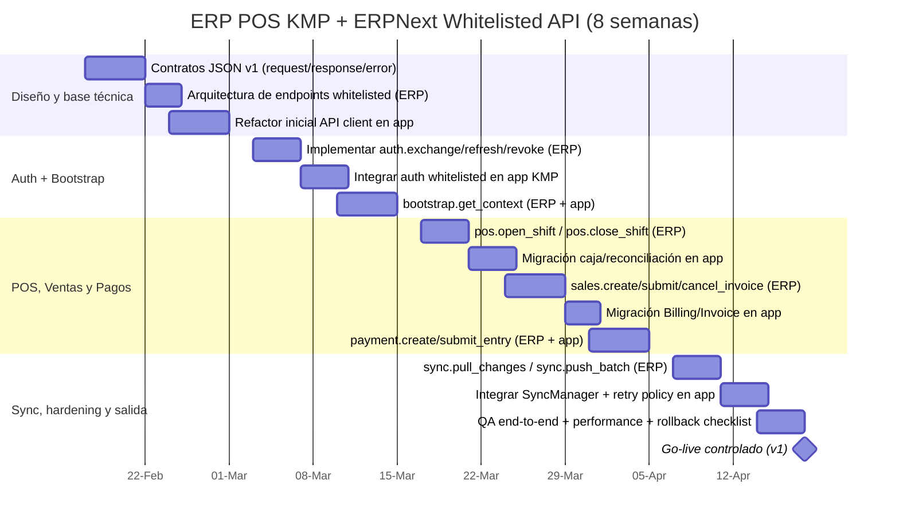

# Plan técnico (8 semanas): ajustes app móvil POS + API ERPNext `@frappe.whitelist`

## Objetivo
Definir un plan **ejecutable en máximo 2 meses (8 semanas)** para:
1. Ajustar la app móvil POS KMP (Android/iOS/Desktop shared logic) para consumir API versionada.
2. Crear en ERPNext v15/v16 métodos `@frappe.whitelist` que reemplacen endpoints genéricos actuales.
3. Migrar por fases autenticación, operaciones de caja, ventas, pagos y sincronización con manejo robusto de errores.

---

## 1) Alcance real del plan (enfoque solicitado)

### A. Ajustes en la app móvil (KMP)
- Refactor de `APIService` para desacoplar rutas hardcodeadas (`frappe.client.*`, `resource/*`).
- Nuevo cliente de API móvil versionada (`/api/method/erpnext_pos.api.mobile.v1.*`).
- Normalización de manejo de errores (`code`, `message`, `details`, `request_id`).
- Trazabilidad para sincronización y auth (logs/sentry por operación crítica).
- Migración progresiva sin romper operación offline-first.

### B. Construcción de API en ERPNext
- Crear módulo Python en app custom (`erpnext_pos/api/mobile/v1`).
- Exponer métodos `@frappe.whitelist` por dominio: auth, bootstrap, pos, sales, payment, customer, sync.
- Enforzar validaciones de permisos, idempotencia y contratos JSON estables.
- Mantener compatibilidad v1 y estrategia de rollback.

---

## 2) Gantt de ejecución (máximo 2 meses)



> Duración total: **8 semanas**. Se puede desplazar la fecha de inicio sin alterar la secuencia.

---

## 3) Cronograma semanal detallado (W1–W8)

| Semana | App móvil KMP (ajustes) | ERPNext API (`@whitelist`) | Entregable de semana |
|---|---|---|---|
| W1 | Extraer capa de rutas API + mapeo centralizado de endpoints. | Definir estructura `erpnext_pos.api.mobile.v1` y contrato de errores. | Especificación técnica cerrada + backlog técnico. |
| W2 | Adaptar cliente HTTP para respuesta estándar (`ok/data/error/meta`). | Publicar `auth.exchange_token`, `auth.refresh_token`, `auth.revoke_token`. | Login/refresh funcional sobre métodos whitelisted. |
| W3 | Migrar flujo login/session refresher a nuevos métodos. | Publicar `bootstrap.get_context` para carga inicial de catálogos mínimos. | Arranque de sesión con bootstrap server-side. |
| W4 | Migrar módulo de caja (open/close) en app. | Publicar `pos.open_shift` y `pos.close_shift` con validaciones. | Caja operativa sobre API whitelisted. |
| W5 | Migrar Billing/Invoice submit/cancel a endpoints nuevos. | Publicar `sales.create_invoice`, `sales.submit_invoice`, `sales.cancel_invoice`. | Ciclo de factura POS en v1 listo. |
| W6 | Migrar PaymentEntry y enlaces con factura. | Publicar `payment.create_entry`, `payment.submit_entry`. | Cobros migrados y conciliables. |
| W7 | Integrar sync incremental y cola de pendientes con nuevos métodos. | Publicar `sync.pull_changes`, `sync.push_batch`. | Sincronización unificada por API móvil. |
| W8 | Hardening, feature flags, fallback controlado, QA final. | Ajustes de performance, auditoría y monitoreo. | Release candidato + plan de rollback. |

---

## 4) Mapa de migración: endpoint actual → método `@whitelisted`

| Caso | Endpoint actual en app | Método nuevo recomendado |
|---|---|---|
| Exchange token | `/api/method/frappe.integrations.oauth2.get_token` | `/api/method/erpnext_pos.api.mobile.v1.auth.exchange_token` |
| Refresh token | `/api/method/frappe.integrations.oauth2.get_token` | `/api/method/erpnext_pos.api.mobile.v1.auth.refresh_token` |
| Revoke token | `/api/method/frappe.integrations.oauth2.revoke_token` | `/api/method/erpnext_pos.api.mobile.v1.auth.revoke_token` |
| Submit doc (genérico) | `/api/method/frappe.client.submit` | `/api/method/erpnext_pos.api.mobile.v1.sales.submit_invoice` / `payment.submit_entry` / `pos.close_shift` |
| Cancel doc (genérico) | `/api/method/frappe.client.cancel` | `/api/method/erpnext_pos.api.mobile.v1.sales.cancel_invoice` |
| Set value (genérico) | `/api/method/frappe.client.set_value` | Endpoint de dominio específico (`customer.update_contact`, `customer.update_address`) |
| Pull múltiple por resource | `/api/resource/*` con filtros cliente | `/api/method/erpnext_pos.api.mobile.v1.bootstrap.get_context` + `sync.pull_changes` |

---

## 5) Contrato API v1 recomendado (estándar)

### 5.1 Response envelope
```json
{
  "ok": true,
  "data": {},
  "error": null,
  "meta": {
    "request_id": "uuid",
    "api_version": "v1",
    "server_time": "2026-04-18T10:00:00Z"
  }
}
```

### 5.2 Error envelope
```json
{
  "ok": false,
  "data": null,
  "error": {
    "code": "POS_VALIDATION_ERROR",
    "message": "Opening shift is required before invoicing.",
    "details": {
      "pos_profile": "POS-STORE-001"
    }
  },
  "meta": {
    "request_id": "uuid",
    "api_version": "v1",
    "server_time": "2026-04-18T10:01:30Z"
  }
}
```

---

## 6) Lista mínima de métodos `@frappe.whitelist` a construir

### Auth
- `erpnext_pos.api.mobile.v1.auth.exchange_token`
- `erpnext_pos.api.mobile.v1.auth.refresh_token`
- `erpnext_pos.api.mobile.v1.auth.revoke_token`

### Bootstrap/Catálogo
- `erpnext_pos.api.mobile.v1.bootstrap.get_context`

### POS
- `erpnext_pos.api.mobile.v1.pos.open_shift`
- `erpnext_pos.api.mobile.v1.pos.close_shift`

### Sales
- `erpnext_pos.api.mobile.v1.sales.create_invoice`
- `erpnext_pos.api.mobile.v1.sales.submit_invoice`
- `erpnext_pos.api.mobile.v1.sales.cancel_invoice`

### Payment
- `erpnext_pos.api.mobile.v1.payment.create_entry`
- `erpnext_pos.api.mobile.v1.payment.submit_entry`

### Customer
- `erpnext_pos.api.mobile.v1.customer.create`
- `erpnext_pos.api.mobile.v1.customer.update_contact`
- `erpnext_pos.api.mobile.v1.customer.update_address`

### Sync
- `erpnext_pos.api.mobile.v1.sync.pull_changes`
- `erpnext_pos.api.mobile.v1.sync.push_batch`

---

## 7) Implementación técnica en app KMP (paso a paso)

1. Crear `MobileApiRoutes` (constantes por dominio v1) y eliminar strings dispersos.
2. Introducir `MobileApiClient` con serialización uniforme `ok/data/error/meta`.
3. Adaptar `APIService` método por método con feature flag `useWhitelistedApi`.
4. Mapear errores whitelisted a excepciones de dominio (`AuthExpired`, `BusinessRuleViolation`, `RetryableNetworkError`).
5. Ajustar `SyncManager` para que `push` y `pull` usen endpoints batch v1.
6. Mantener fallback temporal al endpoint legado solo durante transición (W2–W7).
7. Remover fallback y congelar contratos v1 al cierre (W8).

---

## 8) Riesgos y mitigación (2 meses)

| Riesgo | Impacto | Mitigación |
|---|---|---|
| Cambios de contrato a mitad del proyecto | Alto | Cerrar contrato en W1 y versionar cambios como `v2`. |
| Regresiones de sync offline | Alto | Pruebas de cola `PENDING/SYNCED/FAILED` desde W4, no al final. |
| Errores de permisos en ERP | Medio/Alto | Matriz de roles por método en W2-W3 + pruebas con usuarios reales. |
| Tiempo corto (8 semanas) | Alto | Migración por dominio y feature flags para entrega incremental. |
| Falta de trazabilidad de fallos | Medio | `request_id` obligatorio en todas las respuestas. |

---

## 9) Criterios de salida (Done)
- Login, refresh y bootstrap funcionando sobre API whitelisted.
- Caja (open/close), venta (create/submit/cancel), cobro (create/submit) migrados.
- Sync pull/push batch operativo con reintentos y errores tipados.
- 0 llamadas productivas a `frappe.client.submit/cancel/set_value` desde app.
- Monitoreo con request_id y bitácora de errores validada por QA.

---

## 10) Resultado esperado al final de 2 meses
Una app POS KMP desacoplada de endpoints genéricos, integrada contra una API móvil ERPNext versionada, con mejor control de autenticación, sincronización y manejo de errores para operación offline-first en producción.
