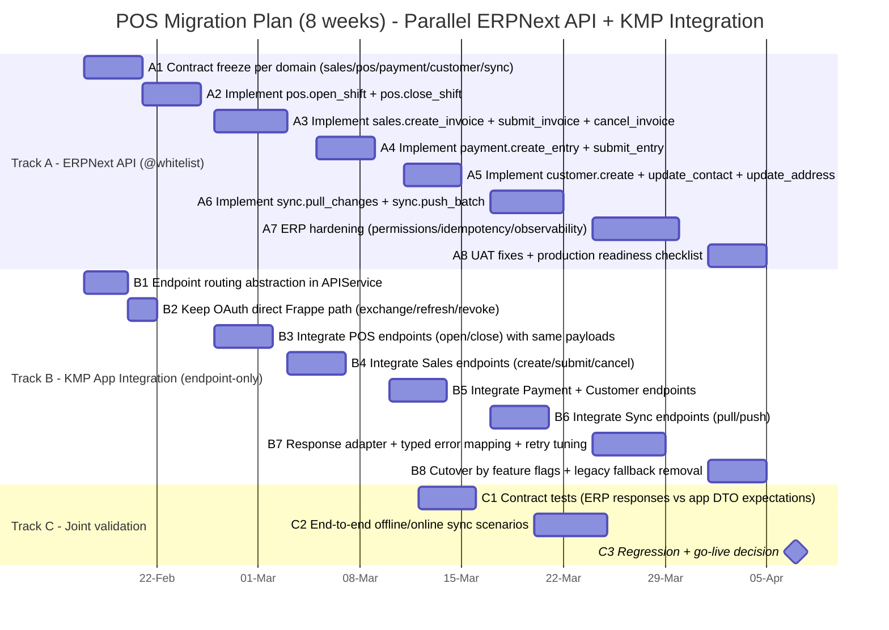

# Technical execution plan (8 weeks): endpoint migration to ERPNext `@frappe.whitelist` + KMP app integration

## Objective
Deliver, in **maximum 2 months (8 weeks)**, a controlled migration focused on:
1. Replacing business endpoints currently used by the mobile POS app with domain `@frappe.whitelist` methods.
2. Keeping authentication endpoints **directly from Frappe OAuth** (no custom whitelist for exchange/login/refresh/revoke).
3. Limiting app impact to endpoint mapping + response/error adaptation, without changing core business behavior.

---

## 1) Non-negotiable scope and constraints

### In scope
- ERPNext API development for business domains (`pos`, `sales`, `payment`, `customer`, `sync`, optional `bootstrap`).
- KMP integration changes only in transport/integration layer (`APIService`, endpoint routing, response/error mapping).
- Standardized error handling and response normalization for new endpoints.
- Parallel workstream execution (ERP API + mobile integration).

### Out of scope
- Rewriting business logic in app modules (billing, inventory logic, sync decision engine).
- UI redesign or flow redesign.
- Replacing OAuth with custom methods.

### Authentication rule (fixed)
The following endpoints remain direct Frappe methods:
- `/api/method/frappe.integrations.oauth2.get_token` (exchange + refresh)
- `/api/method/frappe.integrations.oauth2.revoke_token`
- Current login/session bootstrap path already used by app

---

## 2) Target architecture (minimal-change migration)

## A. ERPNext side (new)
- New namespace: `erpnext_pos.api.mobile.v1.*`
- New business methods by domain with stable request/response contracts.
- No auth replacement.

## B. App KMP side (minimal change)
- Keep existing domain/use-case behavior.
- Replace endpoint URLs in integration layer.
- Add response adapter to parse both legacy (`data/message`) and new (`ok/data/error/meta`) during transition.
- Add robust typed error mapping for UI-safe failures and retry logic.

---

## 3) Parallel Gantt (specific, ERP API + App integration)



> Total duration: 8 weeks, with explicit parallel execution.

---

## 4) Weekly plan (parallel deliverables)

| Week | ERPNext `@whitelist` deliverable | KMP integration deliverable | Validation gate |
|---|---|---|---|
| W1 | Contract freeze for all business domains | Endpoint abstraction and route table in API layer | Contract review approved |
| W2 | POS methods ready (`open_shift`, `close_shift`) | POS route switch in app, no behavior changes | POS integration smoke test |
| W3 | Sales methods ready (`create/submit/cancel`) | Sales route switch in app | Invoice E2E (draft-submit-cancel) |
| W4 | Payment + Customer methods ready | Payment/Customer route switch in app | Customer+Payment regression |
| W5 | Sync methods ready (`pull_changes`, `push_batch`) | Sync route switch in app | Offline queue + recovery tests |
| W6 | Permissions/idempotency hardening | Error mapper + retry policy tuning | Error matrix approval |
| W7 | UAT fixes + observability finalization | Feature-flagged cutover in staging | Staging sign-off |
| W8 | Production readiness and release support | Legacy fallback removal (if stable) | Go-live + post-release checks |

---

## 5) Endpoint migration matrix (updated rules)

| Flow | Current endpoint | Target endpoint |
|---|---|---|
| OAuth exchange code | `/api/method/frappe.integrations.oauth2.get_token` | **Keep current (no whitelist migration)** |
| OAuth refresh token | `/api/method/frappe.integrations.oauth2.get_token` | **Keep current (no whitelist migration)** |
| OAuth revoke | `/api/method/frappe.integrations.oauth2.revoke_token` | **Keep current (no whitelist migration)** |
| POS open/close | Current create/submit flow | `/api/method/erpnext_pos.api.mobile.v1.pos.open_shift` / `close_shift` |
| Sales create/submit/cancel | `resource + frappe.client.submit/cancel` | `/api/method/erpnext_pos.api.mobile.v1.sales.*` |
| Payment create/submit | `resource + frappe.client.submit` | `/api/method/erpnext_pos.api.mobile.v1.payment.*` |
| Customer create/update | `resource + frappe.client.set_value` | `/api/method/erpnext_pos.api.mobile.v1.customer.*` |
| Sync pull/push | mixed `resource` queries | `/api/method/erpnext_pos.api.mobile.v1.sync.*` |

---

## 6) Standard response/error adaptation (for safe integration)

### Recommended whitelist response envelope
```json
{
  "ok": true,
  "data": {},
  "error": null,
  "meta": {
    "request_id": "uuid",
    "api_version": "v1",
    "server_time": "2026-04-07T12:00:00Z"
  }
}
```

### Recommended error envelope
```json
{
  "ok": false,
  "data": null,
  "error": {
    "code": "BUSINESS_RULE_VIOLATION",
    "message": "POS shift must be open before submitting invoice.",
    "details": {
      "pos_profile": "POS-001"
    }
  },
  "meta": {
    "request_id": "uuid",
    "api_version": "v1",
    "server_time": "2026-04-07T12:00:08Z"
  }
}
```

### App-side mapping rules (minimal code impact)
- Keep current DTOs where possible.
- Add adapter layer in API integration to support:
  - legacy: `{"data": ...}` or `{"message": ...}`
  - whitelist: `{"ok":...,"data":...,"error":...,"meta":...}`
- Convert server errors to typed app errors:
  - `AUTH_EXPIRED` → session refresh flow
  - `BUSINESS_RULE_VIOLATION` → user-facing validation message
  - `RETRYABLE_NETWORK_ERROR` → retry/backoff in sync

---

## 7) Method list to implement in ERPNext (business only)

### POS
- `erpnext_pos.api.mobile.v1.pos.open_shift`
- `erpnext_pos.api.mobile.v1.pos.close_shift`

### Sales
- `erpnext_pos.api.mobile.v1.sales.create_invoice`
- `erpnext_pos.api.mobile.v1.sales.submit_invoice`
- `erpnext_pos.api.mobile.v1.sales.cancel_invoice`

### Payment
- `erpnext_pos.api.mobile.v1.payment.create_entry`
- `erpnext_pos.api.mobile.v1.payment.submit_entry`

### Customer
- `erpnext_pos.api.mobile.v1.customer.create`
- `erpnext_pos.api.mobile.v1.customer.update_contact`
- `erpnext_pos.api.mobile.v1.customer.update_address`

### Sync
- `erpnext_pos.api.mobile.v1.sync.pull_changes`
- `erpnext_pos.api.mobile.v1.sync.push_batch`

> Optional (if needed for performance):
- `erpnext_pos.api.mobile.v1.bootstrap.get_context`

---

## 8) Detailed implementation steps (execution order)

1. Freeze domain contracts and error catalog (`W1`).
2. Build ERP methods by domain (`W2-W5`) with permissions and idempotency from day one.
3. Integrate endpoints in app by domain (`W2-W5`) without changing business logic.
4. Enable adapter for mixed responses during transition (`W3-W6`).
5. Run joint contract + E2E tests after each domain switch.
6. Activate feature flags for staged cutover and controlled rollback.
7. Remove legacy fallback only after stable staging + production canary.

---

## 9) Acceptance criteria (Done)
- OAuth/login/refresh/revoke still using direct Frappe endpoints.
- All business operations migrated to `erpnext_pos.api.mobile.v1.*`.
- No behavioral regressions in POS flow (same business results before/after migration).
- Typed error handling operational for auth/business/network categories.
- Offline-first sync validated with pull/push on new methods.
- Legacy business endpoints deprecated after stable release.

---

## 10) Final expected result after 8 weeks
A low-risk endpoint migration where the app keeps its current business behavior, authentication remains on direct Frappe OAuth, and business APIs are standardized through ERPNext `@frappe.whitelist` methods with robust error handling and parallel delivery.
