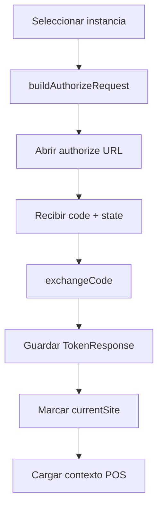

# Inicio de sesión multi instancia y gestión de sesión

## 1. Objetivo
Permitir que el POS trabaje con **múltiples sitios ERPNext** sin cambiar código de negocio: solo se cambia la instancia activa y la capa API resuelve automáticamente la URL base.

## 2. Modelo de datos de instancia

Cada instancia usa `LoginInfo`:

```json
{
  "url": "https://erp-a.miempresa.com",
  "redirect_uri": "com.erpnext.pos://oauth/callback",
  "clientId": "pos-mobile",
  "clientSecret": "***",
  "scopes": ["all", "openid"],
  "name": "Empresa A",
  "lastUsedAt": 1738000000000,
  "isFavorite": true
}
```

Campos de control:
- `lastUsedAt`: priorizar instancia reciente.
- `isFavorite`: fijar instancia preferida.

## 3. Flujo de login por instancia



## 4. Contrato de token (instancia activa)

`TokenResponse` esperado:

```json
{
  "access_token": "...",
  "token_type": "Bearer",
  "expires_in": 3600,
  "refresh_token": "...",
  "id_token": "...",
  "scope": "all openid"
}
```

## 5. Resolución de sitio activo

- `AuthInfoStore.getCurrentSite()` define la URL base actual.
- `APIService` usa esa URL para construir endpoints.
- No se requiere cambiar mappers, DTOs ni use cases al cambiar instancia.

## 6. Refresh y vida de sesión

### 6.1 `SessionRefresher`
- Verifica token disponible.
- Si token cerca de expirar o inválido y hay red, ejecuta refresh.
- Si refresh falla pero token aún válido, continúa operación.
- Si no hay forma válida de autenticación, invalida sesión y navega a login.

### 6.2 `TokenHeartbeat`
- Refresco periódico (por defecto cada 5 min).
- Refresco adicional al evento resume.
- En offline no fuerza refresh (permite continuidad local).

## 7. Cambio de instancia en caliente

### Estrategia recomendada
1. Detener sync actual.
2. Guardar metadatos de última instancia usada.
3. Actualizar `currentSite`.
4. Limpiar tokens de instancia anterior (si política lo exige).
5. Reinicializar DI/contexto de datos (Desktop ya reinicia Koin).
6. Cargar contexto inicial de la nueva instancia.

## 8. Política de datos locales al cambiar instancia

### Opción A (aislamiento fuerte, recomendada)
- DB por instancia (`erp_a.db`, `erp_b.db`).
- Evita mezcla de clientes/facturas entre compañías.

### Opción B (DB única con partition key)
- Todas las entidades con `siteUrl`/`tenantId`.
- Consultas siempre filtradas por instancia activa.

> Si el objetivo es “cambiar solo URL sin tocar negocio”, A suele ser más segura en producción.

## 9. Errores y manejo UX

- `state` OAuth inválido: abortar login (protección CSRF).
- `redirect_uri` incorrecta: error de configuración de instancia.
- `clientId/clientSecret` inválidos: mostrar error de credenciales de app.
- instancia caída: permitir modo local y reintento posterior.

## 10. Checklist operativo multi instancia

- [ ] Todas las llamadas API usan `getCurrentSite()`.
- [ ] Token/refresh se asocian a instancia activa.
- [ ] Al switch no quedan jobs de sync de instancia previa.
- [ ] La UI muestra claramente instancia actual.
- [ ] Logs y errores incluyen contexto `siteUrl`.
