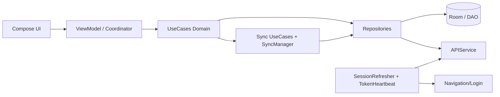
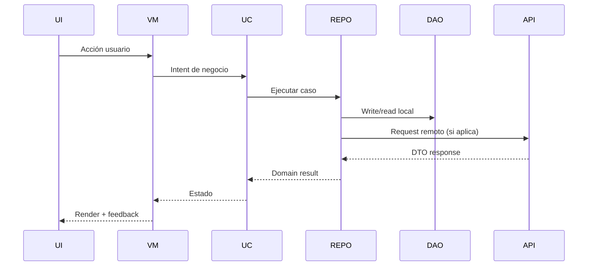

# Documentación integral del proyecto ERP POS (KMP)

> Alcance: cobertura funcional y técnica **completa** de la app POS KMP conectada a ERPNext v15/v16, incluyendo login multi instancia, operación offline-first, sincronización y contratos de integración.

## 1. Visión general del producto

ERP POS KMP es una aplicación de venta omniplataforma (Android/iOS/Desktop) con una base de código compartida en Kotlin Multiplatform. El principio rector es:

- **La operación comercial no se detiene por conectividad**.
- **La base local (Room) permite crear/consultar documentos sin red**.
- **La sincronización empuja y actualiza datos contra ERPNext cuando hay sesión válida + conectividad**.

## 2. Cobertura funcional de la app

### 2.1 Flujos comerciales soportados
- Ventas (Sales Invoice) en modo offline/online.
- Pagos y conciliación (Payment Entry).
- Clientes (lectura y alta).
- Documentos comerciales secundarios (Quotation, Sales Order, Delivery Note).
- Caja POS (apertura/cierre y control de sesión operativa).

### 2.2 Flujos de datos soportados
- Catálogo: grupos, items, precios, inventario/bins.
- Maestros: compañía, usuario, perfil POS, términos de pago, modos de pago, territorios, grupos de cliente.
- Cartera: facturas, vencidos/outstanding, pagos aplicados.

## 3. Arquitectura funcional completa

## 4. Flujo end-to-end de una sesión real

### 4.1 Login / selección de instancia
1. Usuario selecciona o crea instancia ERP (URL, clientId, redirectUri, etc.).
2. Se dispara OAuth2 Authorization Code.
3. App intercambia `code` por tokens y persiste `TokenResponse`.
4. Queda activa una instancia “current site”.

### 4.2 Carga de contexto operativo
1. Carga user/company/profile POS/territorio.
2. Carga catálogos operativos mínimos.
3. Habilita caja operativa y navegación de POS.

### 4.3 Operación offline-first
1. Usuario crea documentos en UI.
2. UseCase persiste en local con `SyncStatus.PENDING`.
3. UI confirma inmediatamente el resultado local.
4. Si red disponible, push puede ejecutarse de inmediato o por ciclo de sync.

### 4.4 Sincronización
1. `SyncManager` valida precondiciones (caja, red, sesión, TTL).
2. Push de pendientes por orden de negocio.
3. Pull incremental por filtros (`modified`, fechas, territorio, warehouse, etc.).
4. Reconciliación local + actualización de estado sync.

### 4.5 Manejo de incidentes
- Sin red: operación local continúa.
- Token inválido/expirado sin refresh: logout controlado.
- Fallas parciales de sincronización: estado PARTIAL/FAILED con reintentos.

## 5. Flujo por capas (detalle)

## 6. Módulos y responsabilidades (cobertura total)

### 6.1 UI y navegación
- `navigation/`, `ui/`, `views/`: rutas, top bars, componentes y pantallas de negocio.

### 6.2 Dominio
- `domain/models`: modelos de negocio.
- `domain/usecases`: casos de uso base.
- `domain/usecases`: flujo operativo de negocio (offline, snapshot, sync por doc-type).

### 6.3 Datos
- `data/repositories`: coordinación local-remoto.
- `data/mappers`: transformaciones Entity/DTO/Domain.

### 6.4 Persistencia local
- `localSource/entities`: esquema Room.
- `localSource/dao`: acceso transaccional.
- `localSource/relations`: consultas compuestas.

### 6.5 Integración remota
- `remoteSource/api/APIService.kt`: integración REST principal ERPNext (v1 operativa).
- `remoteSource/dto`: contratos serializables JSON.
- `remoteSource/sdk`: helpers genéricos de transporte, filtros y errores.

### 6.6 Autenticación y sesión
- `remoteSource/oauth/*`: configuración OAuth, store de auth y tokens.
- `auth/SessionRefresher.kt`: validación + refresh token.
- `auth/TokenHeartbeat.kt`: refresco periódico y en resume.
- `auth/InstanceSwitcher.kt`: cambio de instancia activa.

### 6.7 Sincronización
- `sync/SyncManager.kt`: orquestación de corrida de sync y estado.
- `domain/usecases/sync/*`: unidades de sync por doctype.

## 7. Estrategia offline-first (detallada)

1. **Escritura local primero** para no bloquear operación comercial.
2. **Estado de sincronización por documento** (`PENDING`, `SYNCED`, `FAILED`).
3. **Push idempotente orientado a negocio** (evitar duplicados por firmas/criterios).
4. **Pull incremental** con filtros de ventana temporal y `modified`.
5. **ERPNext como source of truth** para reconciliación final.

## 8. Gestión de errores y observabilidad

- Retries con backoff para timeout de red.
- Captura de excepciones y breadcrumbs en Sentry.
- Logging operativo para diagnóstico de sync/auth.
- Mensajería de estado de sync hacia UI.

## 9. Multi instancia: visión general (resumen)

La app está preparada para múltiples instancias ERP:
- Persistencia de múltiples `LoginInfo`.
- Selección de `currentSite` para resolver base URL de API.
- Refresh tokens y sesión atados a la instancia activa.
- Mecanismo de switch de instancia (reinicio de contexto DI en Desktop).

> Ver detalle operativo completo en `docs/multi_instance_login_and_session.md`.
